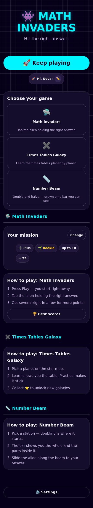
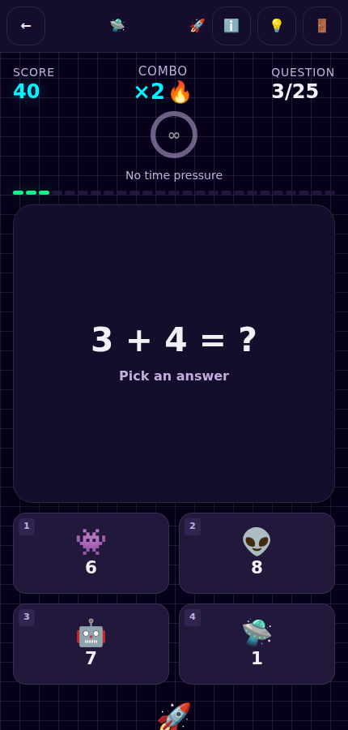
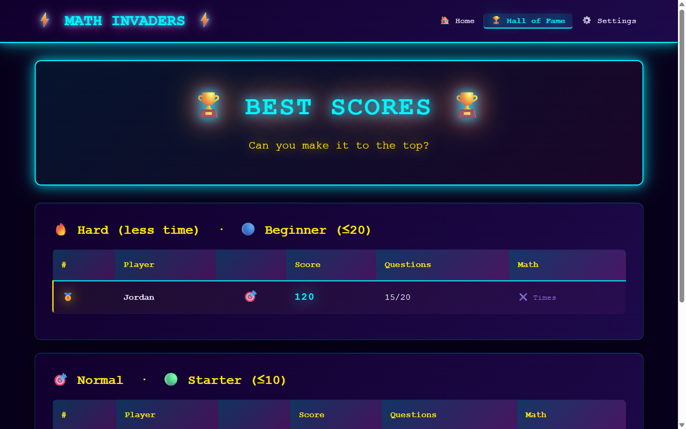
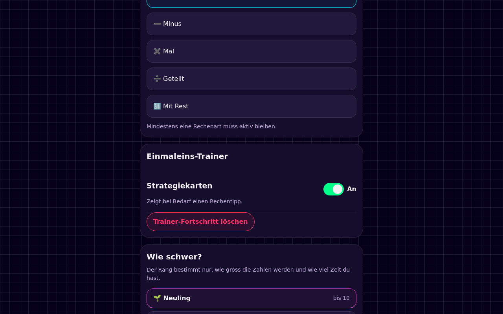
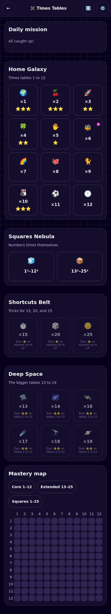
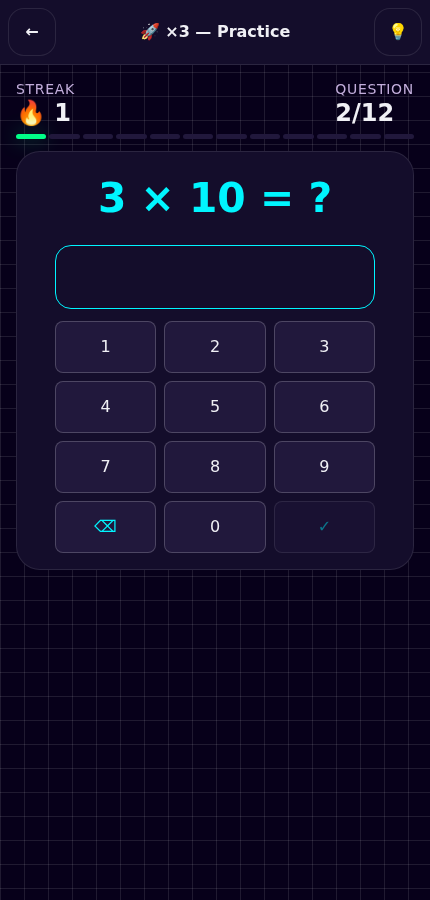
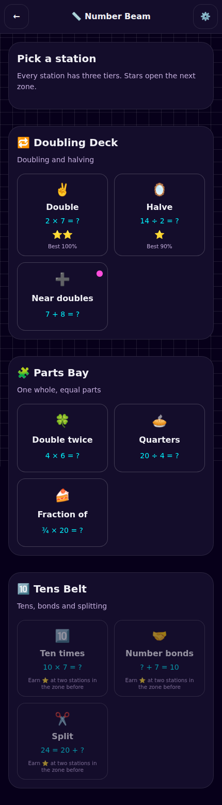
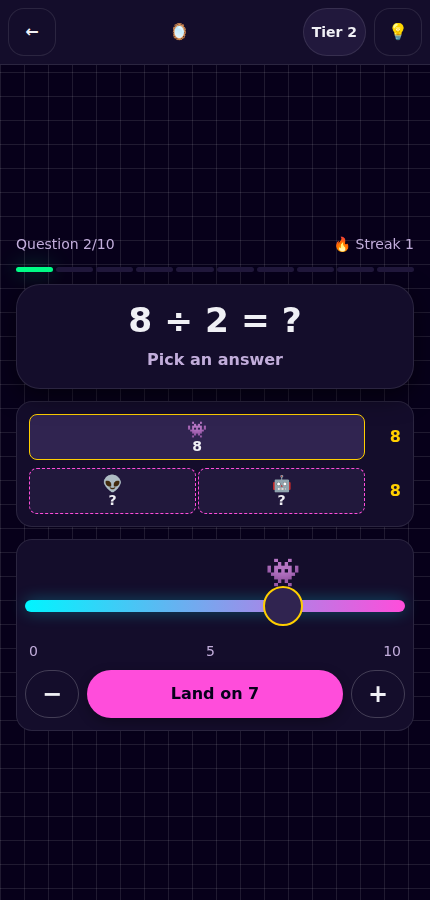

# 🛸 Math Invaders

[](https://github.com/patbaumgartner/math-invaders/actions/workflows/deploy.yml)
[](https://opensource.org/licenses/MIT)
[](http://makeapullrequest.com)

> A free, privacy-friendly maths arcade game for children. Play online at **[patbaumgartner.github.io/math-invaders](https://patbaumgartner.github.io/math-invaders)** with automatic GitHub Pages deployment—no backend required.

**[🎮 Play Now](https://patbaumgartner.github.io/math-invaders)** · **[📖 How to Play](#-how-to-play)** · **[🏗️ Architecture](#-architecture)** · **[🤝 Contributing](#-contributing)**

| Home | Game |
|------|------|
|  |  |

| Hall of Fame | Settings |
|-------------|----------|
|  |  |

| Times Tables Galaxy | Trainer practice |
|---------------------|------------------|
|  |  |

| Number Beam stations | Moving the alien on the bar |
|----------------------|-----------------------------|
|  |  |

---

## 🎮 How to Play

1. **Press Play** — a profile is created for you, so you start straight away
2. **Tap the alien** holding the right answer — one tap, no aiming
3. **Chain correct answers** to build a combo multiplier
4. **Finish all 25 questions** and collect up to ⭐⭐⭐

Every mission is exactly 25 questions. A wrong answer costs your combo and a bit of
accuracy, but it never ends the run — so a tricky day means *more* practice, not less.

## ✖️ Times Tables Galaxy

Times Tables Galaxy is a focused multiplication trainer available from the game picker
after a profile is created. Its planet map covers tables 1–12, squares, shortcuts
(15, 20 and 25), and larger tables 13–19. Learn introduces skip-counting and a strategy
card; Practice adapts to due and weak facts; and an accurate Speed Run unlocks after the
first star. Earn ⭐ for Practice, ⭐⭐ for a fast accurate run, and ⭐⭐⭐ by mastering every
fact. Leitner-style review builds a Daily Mission, while the mastery heatmap distinguishes
unseen, learning, due, and mastered facts.

## 📏 Number Beam

Number Beam is the third section in the game picker, and it is about doubling, halving
and the number sense that grows out of them. **Every question is drawn as a bar**: the
whole on top, the parts that make it underneath. Both rows are measured against one
shared scale, so a doubled bar really is twice as long — and unknown parts stay behind
a `?` until you answer, then fill in with their numbers.

**Every other question is answered by moving an alien along the beam.** Instead of
picking a tile, you drag the alien, nudge it with −/+ or walk it with the arrow keys,
then land it on the answer. Underneath it is a native range slider, so it works with a
finger, a mouse, a keyboard and a screen reader alike.

### Stations

Nine stations in three zones. Each one opens once two stations in the zone before it
have a star:

| Zone | Stations | Example |
|------|----------|---------|
| 🔁 Doubling Deck | Double · Halve · Near doubles | `2 × 7 = ?` · `14 ÷ 2 = ?` · `7 + 8 = ?` |
| 🧩 Parts Bay | Double twice · Quarters · Fraction of | `4 × 6 = ?` · `20 ÷ 4 = ?` · `¾ × 20 = ?` |
| 🔟 Tens Belt | Ten times · Number bonds · Split | `10 × 7 = ?` · `? + 7 = 10` · `24 = 20 + ?` |

Prompts are written in pure maths notation, so they read identically in all four
languages — the station name carries the concept and the bar carries the meaning.

Each station has **three tiers**, and the tier is simply how many stars you already
hold: numbers widen as you improve, so a station you have mastered never goes stale.
A drill is ten questions. ⭐ at 70 % accuracy, ⭐⭐ at 90 % once you hold one, and ⭐⭐⭐
for a clean sweep once you hold two. Stars never fall.

**Controls:**
- **Touch / mouse:** tap or click an answer tile
- **Keyboard:** `1`–`4` fire at that tile directly; arrow keys move focus, Enter/Space fires

**Countdown:** off by default. Switch it on in Settings for time pressure — it pauses
automatically when you open Help or switch tabs.

---

## 📐 Game Mechanics

### Scoring
- **Correct answer:** 10 points × your combo multiplier
- **Combo:** ×2 after 3 correct in a row, ×3 after 6, ×4 after 10
- **Wrong answer / time's up:** combo resets to ×1 — you keep your points and your mission

### Stars
Awarded at the end of a mission from accuracy:

| Stars | Accuracy |
|-------|----------|
| ⭐⭐⭐ | ≥ 90 % |
| ⭐⭐ | ≥ 70 % |
| ⭐ | ≥ 50 % |

### Equation Forms

The same five operations now appear in five different shapes, which is where most of
the variety comes from:

| Form | Example | Asks for |
|------|---------|----------|
| Direct | `7 + 5 = ?` | the result |
| Missing right | `7 + ? = 12` | the second operand |
| Missing left | `? + 5 = 12` | the first operand |
| Missing operator | `7 ? 5 = 12` | which of `+ − × ÷` fits |
| Chain | `(7 + 5) − 3 = ?` | a two-step result |

Missing-operator prompts are generated by rejection sampling: a candidate is only kept
when **exactly one** operator satisfies it, so genuinely ambiguous prompts like
`4 ? 2 = 2` (both `−` and `÷`) or `2 ? 2 = 4` (both `+` and `×`) never appear.

### Math Operations

| Mode | Example | Notes |
|------|---------|-------|
| ➕ Addition | `7 + 3 = ?` | Basic arithmetic |
| ➖ Subtraction | `10 − 4 = ?` | All results ≥ 0 |
| ✖️ Multiplication | `6 × 7 = ?` | Factors stay within the ×12 tables |
| ➗ Division | `20 ÷ 4 = ?` | Built from the answer outwards, so always exact |
| 🔢 Division + Remainder | `23 ÷ 5 = 4 r3` | Every option obeys `0 ≤ remainder < divisor` |

Multiple operations can be active at once; the game weights its choice towards whatever
you keep getting wrong (see [Adaptive Learning](#-adaptive-learning)). Remainders are a
result *format* rather than a binary operator, so they always appear in direct form.

### Ranks

One ladder sets the numbers, the clock and the unlocked forms:

| Rank | Numbers | Base time | Forms |
|------|---------|-----------|-------|
| 🌱 Rookie | ≤ 10 | 20 s | Direct |
| ⭐ Cadet | ≤ 20 | 18 s | + Missing right |
| 🚀 Pilot | ≤ 50 | 16 s | + Missing left |
| 🔥 Ace | ≤ 100 | 15 s | + Missing operator |
| 👑 Legend | ≤ 500 | 14 s | + Chain |
| 💫 Supernova | ≤ 1000 | 13 s | All five |

Harder forms add a few seconds of thinking time on top. Direct questions stay the most
common form at every rank, so unlocking something new seasons a mission instead of
taking it over.

### Languages

German · Italian · English · French

The UI is fully translated and `<html lang>` follows your choice. Flags in the picker
are drawn as SVG rather than 🇩🇪-style emoji, which collapse to bare "DE"/"GB" letters
on Windows and most Linux desktops. Worked solutions are
written in pure maths notation (`12 − 7 = 5`), so they read identically in every language.

---

## 🧠 Adaptive Learning

### Spaced Repetition
Each operation carries a review interval (SM-2 inspired). Operations you get wrong come
back on the next question; ones you have mastered are shown less often.

### Weakness Weighting
Repeated misses on an operation raise its odds of being drawn next.

### Worked Solutions
Every question ships its own step-by-step working — the inverse operation for a missing
operand, both steps for a chain. It appears automatically after a miss, and on demand
from the 💡 Help button, which pauses the countdown while it is open.

### Skill Mastery Badges
Each operation keeps a rolling accuracy history (last 30 answers):

| Badge | Threshold |
|-------|-----------|
| 🥉 Bronze | ≥ 45 % |
| 🥈 Silver | ≥ 65 % |
| 🥇 Gold | ≥ 80 % |
| 💎 Platinum | ≥ 95 % |

Badges appear on the operation buttons in Settings.

### Personal Bests
The fastest correct response per operation is tracked and celebrated on the summary screen.

---

## ⚙️ Settings Reference

Settings are grouped by the game they affect, because all three games share the page:

- **🛸 Math Invaders** — what to practise, rank, countdown, worked solutions
- **✖️ Times Tables Galaxy** — strategy cards, trainer progress reset
- **📏 Number Beam** — always show the bar, beam progress reset
- **⚙️ All games** — language, sound, clearing all data


| Setting | Options | Default | Notes |
|---------|---------|---------|-------|
| Practise | ➕ ➖ ✖️ ➗ 🔢 | ➕ Addition | Several can be active at once |
| Rank | Rookie → Supernova | 🌱 Rookie | Numbers, time and unlocked forms |
| Language | German · Italian · English · French | German | UI language, picked by drawn flag |
| ⏱ Countdown | On / Off | Off | Time pressure per question |
| 🔊 Sound | On / Off | On | Hit and miss effects |
| 💡 Worked solutions | On / Off | On | Working after a miss, plus the Help button |
| ✖️ Strategy cards | On / Off | On | Optional hints during trainer practice |
| ✖️ Trainer progress | Reset | — | Clears only trainer facts, stars and best times |
| 📏 Always show the bar | On / Off | On | Off hides the bar model until a miss |
| 📏 Beam progress | Reset | — | Clears only Number Beam stars and best scores |
| 🗄 Data | — | — | Clear everything stored on this device |

---

## 🏆 Hall of Fame

Reached from the Math Invaders section on the home page — the leaderboard belongs to
the arcade game, so the trainer does not link to it.

- **One best entry per rank and per clock setting** — a relaxed run never overwrites a timed one
- **No backend:** scores stay in your browser's `localStorage`
- **Earlier scores** from before the rework are kept read-only under "Earlier". They are
  not converted, because combo scoring and the fixed 25-question mission make the old
  numbers incomparable

---

## 🏗️ Architecture

**Static React app on GitHub Pages** — No backend server required.

```
┌─ React 19 + TypeScript
├─ Three games, one shell
│  ├─ 🛸 Math Invaders      — the one-tap arcade game
│  ├─ ✖️ Times Tables Galaxy — the multiplication trainer
│  └─ 📏 Number Beam        — doubling and halving on a bar model
├─ Pages
│  ├─ Home: profile and the game picker
│  ├─ Game: the arcade mission loop
│  ├─ Hall of Fame: Math Invaders leaderboards
│  ├─ Times Tables: galaxy map and the four trainer phases
│  ├─ Number Beam: station map and the ten-question drill
│  └─ Settings: grouped by which game each control affects
├─ Storage
│  └─ localStorage: Player data, game state, scores
└─ Deploy
   └─ GitHub Actions → GitHub Pages
```

### Tech Stack

- **Frontend:** React 19.2, React Router 8.3, TypeScript 7.0
- **Build:** Vite 8 (fast hot reload)
- **Styling:** Token-driven CSS design system (deep-space palette, fluid type, `100dvh`)
- **Storage:** Browser localStorage (zero tracking)
- **Testing:** Vitest (domain in Node, UI in jsdom + Testing Library) and Playwright (desktop + mobile Chromium)
- **Deploy:** GitHub Pages + GitHub Actions

### Project Structure

```
web/
├── public/
│   ├── 404.html        # SPA redirect for GitHub Pages
│   ├── manifest.json   # PWA manifest
│   ├── sw.js           # Offline app-shell cache
│   └── favicon.svg     # App icon
├── e2e/                # Playwright specs — smoke, game, settings,
│                       # hall of fame, times tables, a11y, responsive, PWA
├── src/
│   ├── pages/
│   │   ├── HomePage.tsx        # Instant play + profile
│   │   ├── GamePage.tsx        # Mission loop (phase machine)
│   │   ├── HallOfFamePage.tsx  # Scores by rank
│   │   ├── SettingsPage.tsx    # Three choices + advanced
│   │   ├── TimesTablesPage.tsx # Times Tables Galaxy map
│   │   ├── NumberBeamPage.tsx  # Number Beam station map
│   │   ├── BeamDrillPage.tsx   # Number Beam drill loop
│   │   └── trainer/            # Learn, Practice, Speed Run and Daily Mission
│   ├── components/
│   │   ├── AnswerGrid.tsx      # 2x2 one-tap answer tiles
│   │   ├── GameHud.tsx         # Score, combo, timer ring, trail
│   │   ├── MissionSummary.tsx  # Stars, stats, play again
│   │   ├── NumberPad.tsx       # Trainer numeric input
│   │   ├── BarModel.tsx        # Whole-and-parts bar with aliens
│   │   ├── BeamSlider.tsx      # Move the alien along the beam
│   │   ├── FactHeatmap.tsx     # Trainer mastery grid
│   │   ├── SessionSummary.tsx  # Trainer results
│   │   ├── TopBar.tsx         # The one navigation bar, used by every game
│   │   ├── Flag.tsx           # Drawn language flags
│   │   └── ErrorBoundary.tsx   # Crash fallback
│   ├── game/                   # Pure domain — no React, fully tested
│   │   ├── types.ts            # Ranks, forms, scoring
│   │   ├── rng.ts              # Seedable PRNG (deterministic tests)
│   │   ├── equations.ts        # Per-operation arithmetic + operator rules
│   │   ├── options.ts          # Distractor generation
│   │   ├── questions.ts        # Assembles forms into questions
│   │   ├── mission.ts          # Mission state reducer
│   │   └── examples.ts         # Worked examples
│   ├── beam/                   # Number Beam domain — no React, fully tested
│   │   ├── types.ts            # Skills, bar model, tiers and stars
│   │   ├── stations.ts         # Zones, stations, caps and unlocking
│   │   ├── questions.ts        # One generator per skill
│   │   ├── bars.ts             # Bar geometry and beam sizing
│   │   ├── session.ts          # Drill reducer
│   │   └── beamStore.ts        # Stars, bests and beam settings
│   ├── store/                  # localStorage — no React
│   │   ├── storage.ts          # Safe JSON read/write
│   │   ├── settings.ts         # Settings + v1 migration
│   │   ├── scores.ts           # Scores v2 + legacy records
│   │   └── progress.ts         # Player, weakness, SR, badges
│   ├── timesTable/             # Trainer domain, storage and routing
│   ├── test/                   # Shared jsdom setup and render helpers
│   ├── App.tsx         # Router
│   ├── App.css         # Token-driven design system
│   ├── timesTable.css  # Trainer-specific styles
│   ├── beam.css        # Bar model and beam styles
│   ├── hooks.ts        # Countdown, page visibility, modal dialogs
│   ├── sound.ts        # Web Audio effects
│   ├── translations.ts # i18n (de/it/en/fr)
│   └── constants.ts    # Avatars, language labels
├── index.html
├── vite.config.ts
├── vitest.config.ts      # Two projects: domain (node) and ui (jsdom)
├── playwright.config.ts  # Runs against the production build
├── tsconfig.json
├── eslint.config.js
└── package.json
```

Tests live beside the code they cover: `*.test.ts` for pure logic, `*.test.tsx` for
anything that renders.

---

## 🚀 Development

### Setup

```bash
cd web
npm install
npm run dev
```

Opens [http://localhost:5173/math-invaders](http://localhost:5173/math-invaders)

### Build

```bash
npm run build
```

Output in `web/dist/` — deploy to GitHub Pages or any static host.

### Test

```bash
npm test              # 343 unit tests (domain + UI)
npm run test:coverage # with coverage, gated at 95 % statements
npm run test:e2e      # 138 Playwright tests, desktop + mobile Chromium
npm run test:all      # everything
```

Three layers: pure domain logic in Node, React components and pages in jsdom, and the
built bundle driven through a real browser. See **[docs/TESTING.md](docs/TESTING.md)**
for the full strategy, helpers and conventions.

`npm run lint`, `npm run test:coverage`, `npm run build` and `npm run test:e2e` all run in CI.

### Lint

```bash
npm run lint
```

---

## 🌐 Deployment

**Automatic via GitHub Actions** on push to `main`:

1. Install dependencies
2. Build with Vite
3. Deploy `dist/` to GitHub Pages
4. Live at [patbaumgartner.github.io/math-invaders](https://patbaumgartner.github.io/math-invaders)

See [`.github/workflows/deploy.yml`](.github/workflows/deploy.yml) for details.

---

## 🎨 Design Philosophy

- **No ads, no tracking, no monetization**
- **Child-safe:** Pure black + neon colors, no hidden patterns
- **Privacy-first:** All data stays on your device
- **Offline-capable:** Works without internet after initial load
- **Accessible:** Native buttons, visible focus rings, 44 px minimum touch targets,
  `prefers-reduced-motion` support, dialogs that trap focus and close on Escape, and
  labels that stay in the accessibility tree even when a phone hides them — all
  verified by the automated accessibility and responsive suites
- **Consistent:** all three games share one navigation bar, so the way out is always
  the first control in the top-left, whichever game a child is in

---

## ❓ FAQ

**Q: Is my data private?**  
A: Yes. Everything is stored locally using browser localStorage. No server, no cloud, no analytics.

**Q: Can I play offline?**  
A: Yes, after the initial page load, the app works offline.

**Q: How do I save my progress?**  
A: Create a player profile. Scores auto-save to localStorage.

**Q: Can I use it on mobile?**  
A: Yes — the game screen is built mobile-first and fits a single portrait viewport. Just tap the answer you want.

**Q: How do I reset my data?**  
A: Settings → More settings → Delete all data to wipe profile and scores.

---

## 📄 License

This project is licensed under the MIT License - see the [LICENSE](LICENSE) file for details.

---

## 🤝 Contributing

Contributions make the open source community such an amazing place to learn, inspire, and create. Any contributions you make are **greatly appreciated**.

Please read our [Contributing Guidelines](CONTRIBUTING.md) and [Code of Conduct](CODE_OF_CONDUCT.md) before submitting a pull request. The [Testing Guide](docs/TESTING.md) explains how the three test layers fit together. We also have a [Security Policy](SECURITY.md) and [Changelog](CHANGELOG.md).

---

Enjoy! 🎮⚡
