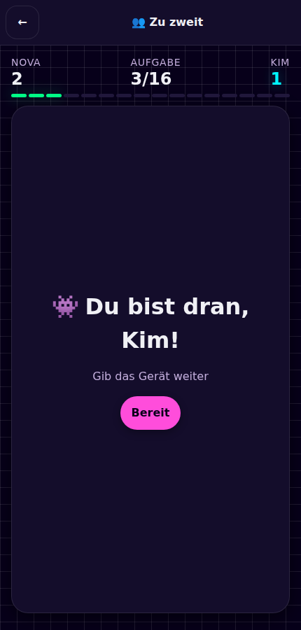

# 🌌 Number Galaxy

> Four free maths games for children, in one page — from seeing how many dots are on a die
> to knowing 7 × 8 by heart. No account, no ads, no tracking, and it keeps working when the
> wifi does not.

**[🎮 Play now](https://patbaumgartner.github.io/math-invaders)** ·
**[👩‍🏫 For teachers](#-for-teachers-and-parents)** ·
**[🧭 Why it is built this way](#-why-it-is-built-this-way)** ·
**[👀 Number Sense](#-number-sense--seeing-how-many)** ·
**[📏 Number Beam](#-number-beam--doubling-halving-and-bar-models)** ·
**[🛸 The arcade](#-math-invaders--the-arcade-game)** ·
**[👥 Two players](#-two-players--one-device)** ·
**[✖️ Times tables](#️-times-tables--the-multiplication-trainer)** ·
**[🛠 Development](docs/DEVELOPMENT.md)**

---

## 👩‍🏫 For teachers and parents

### What each game practises

| Game | Maths it covers | Roughly |
|------|-----------------|---------|
| 👀 **Number Sense** | Seeing quantities without counting them: dot patterns, ten-frames, a bead rack, placing numbers on a line, counting on, and dot arrays | ages 4–7 |
| 📏 **Number Beam** | Doubling, halving, quarters, fractions of an amount, ×10 ÷10, number bonds and partitioning — all drawn as bar models | ages 5–9 |
| 🛸 **Math Invaders** | Addition, subtraction, multiplication, division and remainders — in five different question shapes, with numbers from ≤ 10 up to ≤ 1000 | ages 6–11 |
| ✖️ **Times Tables** | Recall of the tables: 1–12, squares to 25², the 15/20/25 shortcuts, and 13–19 | ages 7–11 |

The ages are an indication, not a gate, and no curriculum is assumed. Each game sets its
own difficulty from what the child has already done, so two children of different ages
can share a device without either being handed the other's numbers.

### What a session looks like

A child presses Play, picks one of four games, and is answering a question within a couple
of taps — there is no menu to learn and no account to make. Each game opens on its own
screen: a map of stations or planets, or for Math Invaders the mission it is about to
serve, with its best scores beside it. A run is short and finite by design: **25 questions** in
the arcade, **10** in a beam drill, one planet's worth of facts in the trainer. A wrong
answer never ends a run early, so a hard day means *more* practice, not less.

If you would rather not choose, **🔀 Surprise me** picks for them — see
[below](#-surprise-me).

### How you can see progress

- **⭐ Stars** on every planet and station, and at the end of every arcade mission.
- **A mastery map** in Times Tables that colours each of the 144 facts as unseen,
  learning, due for review, or mastered — the fastest way to see what is actually stuck.
- **Skill badges** in Settings, one per arcade operation, from a rolling 30-answer
  accuracy history.
- **Worked solutions** after every miss, so a wrong answer teaches something.
- **📋 A progress page** — Settings → Progress — written for you rather than for the child.
  It names the mistake that keeps coming up in plain language, lists the sums to look at
  next, and shows accuracy and stars per game — including whether a child is still counting
  an operation out or knows it by heart. It can be **printed** or **saved as a file**.

There is no account and nothing to log into: the progress page reads what is already on the
device, records nothing of its own, and sends nothing anywhere. That is the whole privacy
model.

### What it never does

No account. No advertising. No analytics, telemetry or third-party scripts. Nothing
leaves the device — there is no server to send it to. After the first visit it works
offline. See [Your data](#your-data).

---

## 👀 Number Sense — seeing how many

The other three games all begin by assuming a child can already see a quantity, count on
from a number, and say roughly where a number sits. Those are not safe assumptions — they
are the strongest predictors of later arithmetic, and every one of them is trainable. This
is where a child who is not yet ready for `2 × 7` has somewhere to be.

### Seven stations in two zones, and a sandbox

| Zone | Stations | What it asks |
|------|----------|--------------|
| 👀 **Sight Bay** | At a glance · Ten-frame · Bead rack | How many — without counting them |
| 📍 **Number Line** | Place it · Count on · Dot array · **Roughly** | Where the number goes, where a jump lands, and about how many |

**🧩 Explore numbers asks nothing at all.** Above the map sits the one screen in the app
with no question, no clock, no score and no star. One number is shown four ways at once — a
die-face pattern, a ten-frame, a bead rack and a place on the line — and the child moves it
with −1 / −5 / −10 and +1 / +5 / +10. Seeing the same sixteen in all four *together* is the
point; four unrelated pictures is what it looks like when they are only ever met one at a
time. Nothing gates it, so it is always the first thing available.

**Patterns are shown for a glance, not for a count.** A dot pattern appears for about a
second and then goes. Scattered dots can only be counted one at a time, which trains
counting and little else; a die face or two rows of five can be *seen*, and it is that
seeing which later becomes "7 is 5 and 2". 👁 **Look again** brings it back as often as a
child wants, and the glance can be switched off entirely in Settings.

**Every arrangement is one a child meets elsewhere** — a die face, a ten-frame in two rows
of five, a bead rack grouped in fives, an empty number line with the jump drawn on it, a dot
array read as rows and columns.

**Two stations allow a near miss, and only two.** Landing on 38 when the answer was 37
counts, and so does answering 30 when 34 dots flashed past. The skill being built in both is
a *sense* of size rather than a count, and marking those wrong would be measuring something
else. 🍇 **Roughly** shows far more dots than anyone can take in at a glance and asks for
about how many, inside a band of a fifth either way. Everywhere a quantity is exact, it
still has to be exact.

Answers are given on the same beam Number Beam uses — nothing to eliminate, and a number to
commit to.

---

## 📏 Number Beam — doubling, halving and bar models

The arcade and the trainer ask a child to *produce a number*. This one shows them what a
number is made of.

| The station map | A question on the bar |
|-----------------|-----------------------|
|  |  |

### Every question is a bar

The whole sits on top, the parts that make it underneath, and **both rows are measured
against one shared scale** — so a doubled bar really is drawn twice as long. Unknown
parts stay behind a `?` until the answer is given, then fill in with their numbers.

That picture is the Singapore-style bar model, and it is the same one whether the
question is doubling, a quarter, a fraction of an amount or a number bond.

### Every answer is given by moving an alien along the beam

There are no answer tiles in this game at all. The child drags the alien, nudges it with
−/+, or walks it with the arrow keys, and lands it on the answer. Underneath is a native
range slider, so it works with a finger, a mouse, a keyboard and a screen reader alike.

This is deliberately harder than multiple choice: there is nothing to eliminate, and the
child has to place the number on a line. Every beam has between 10 and 70 stops, the
answer always sits exactly on one, and it never sits at a predictable fraction of the
bar.

### What it practises

Nine stations in three zones. A zone opens once two stations in the one before it have a
star:

| Zone | Stations | Examples |
|------|----------|----------|
| 🔁 Doubling Deck | Double · Halve · Near doubles | `2 × 7 = ?` · `14 ÷ 2 = ?` · `7 + 8 = ?` |
| 🧩 Parts Bay | Double twice · Quarters · Fraction of | `4 × 6 = ?` · `20 ÷ 4 = ?` · `¾ × 20 = ?` |
| 🔟 Tens Belt | Ten times · Number bonds · Split | `10 × 7 = ?` · `? + 7 = 10` · `24 = 20 + ?` |

Prompts are written in pure maths notation, so they read identically in all four
languages — the station name carries the concept and the bar carries the meaning.

### Difficulty and progress

Each station has **three tiers, and the tier is simply how many stars the child already
holds** — numbers widen as they improve, so a mastered station never goes stale. Number
ranges are bounded by what a bar can actually show; a bar of 900 units is not a picture
anyone can read.

A drill is ten questions: ⭐ at 70 % accuracy, ⭐⭐ at 90 % once one star is held, and ⭐⭐⭐ for
a clean sweep once two are. Stars never fall.

---

## 🛸 Math Invaders — the arcade game

Aliens hold four possible answers; the child taps the one that is right. One tap, no
aiming, no dexterity requirement.

| Playing a mission | Best scores |
|-------------------|-------------|
|  |  |

### What it practises

| Operation | Example | Notes |
|-----------|---------|-------|
| ➕ Addition | `7 + 3 = ?` | |
| ➖ Subtraction | `10 − 4 = ?` | Never goes below zero |
| ✖️ Multiplication | `6 × 7 = ?` | Factors stay inside the ×12 tables |
| ➗ Division | `20 ÷ 4 = ?` | Built from the answer outwards, so always exact |
| 🔢 Division with remainder | `23 ÷ 5 = 4 r3` | Every option obeys `0 ≤ remainder < divisor` |

Several can be switched on at once. The same operations then appear in **five different
question shapes**, which is where most of the variety comes from:

| Shape | Example | Asks for |
|-------|---------|----------|
| Direct | `7 + 5 = ?` | the result |
| Missing right | `7 + ? = 12` | the second number |
| Missing left | `? + 5 = 12` | the first number |
| Missing operator | `7 ? 5 = 12` | which of `+ − × ÷` fits |
| Chain | `(7 + 5) − 3 = ?` | a two-step result |

A missing-operator question is only ever shown when **exactly one** operator fits, so
genuinely ambiguous prompts such as `4 ? 2 = 2` (both `−` and `÷`) never appear.

### Difficulty: the rank ladder

One setting controls how big the numbers get, how much time there is, and which question
shapes are unlocked:

| Rank | Numbers | Time per question | Shapes |
|------|---------|-------------------|--------|
| 🌱 Rookie | ≤ 10 | 20 s | Direct |
| ⭐ Cadet | ≤ 20 | 18 s | + Missing right |
| 🚀 Pilot | ≤ 50 | 16 s | + Missing left |
| 🔥 Ace | ≤ 100 | 15 s | + Missing operator |
| 👑 Legend | ≤ 500 | 14 s | + Chain |
| 💫 Supernova | ≤ 1000 | 13 s | All five |

Harder shapes add a few seconds of thinking time. Direct questions stay the most common
shape at every rank, so unlocking something new seasons a mission rather than taking it
over. A shape a child keeps missing comes round a little more often than one they have.

**Past 100, adding and subtracting use round numbers** — `340 + 200`, not `195 + 87`.
Tapping one of four tiles cannot honestly tell a three-digit column sum from a lucky guess,
whereas round-number arithmetic is a real mental strategy and a real thing to get better at.
Multiplication and division need no such rule: their factors never leave the ×12 tables.

**Inside the rank, the numbers tune themselves.** A rolling window of the last 20 answers
nudges a working ceiling up or down within the rank, keeping a child inside a **70–90 %**
success band — easing off below it, climbing back above it. That band brackets the ~85 %
success rate [Wilson et al. 2019](https://doi.org/10.1038/s41467-019-12874-3) identified as
where learning is fastest; their result comes from models rather than from children, so it is
treated here as a design target rather than a finding about eight-year-olds. It never leaves
the rank that was chosen, and never says anything about it: the point is to keep the practice
fitting, not to grade it.

### Scoring and stars

- **Correct answer:** 10 points × the current combo
- **Combo:** ×2 after 3 in a row, ×3 after 6, ×4 after 10
- **Wrong answer or time out:** the combo resets — the points and the mission both stay

Stars come from accuracy over the whole mission: ⭐⭐⭐ at ≥ 92 %, ⭐⭐ at ≥ 80 %, ⭐ at ≥ 65 %.
The first star sits above 65 % on purpose: with four tiles, guessing alone scores 25 %, so a
lower run says more about the numbers than about the child — and is offered smaller numbers
rather than a verdict.

Speed is only ever shown once accuracy is at least 80 %. A fast run full of misses is not a
faster child, and fluency is flexibility and accuracy before it is pace.

### Word problems

**Off by default.** Switched on in Settings, a sum arrives inside a short situation rather
than as bare numbers — because choosing the operation is a separate skill from carrying it
out, and bare equations never exercise it.

The distinction that matters most is inside division: *sharing* 24 apples between 6 children
and *grouping* 24 apples into bags of 6 give the same answer for entirely different reasons,
and a child who meets only one of them reliably comes unstuck on the other. Both are asked.
A situation the numbers would make nonsense of — sharing 3 apples between 12 children — is
never told at all.

Reading a situation is a second load on top of the arithmetic, which is why it is the
teacher's or parent's call when to add it.

### How it adapts

- **Spaced repetition.** Each operation carries a review interval (SM-2 inspired). One
  the child gets wrong comes back almost immediately; one they have mastered appears
  less often.
- **Weakness weighting.** Repeated misses on an operation raise its odds of being drawn
  next, so practice drifts toward what is not working.
- **A miss comes back.** Every missed question is queued and asked again a few questions
  later — near enough to be the same idea, far enough that the answer has to be recalled
  rather than remembered. Each one returns at most once, so a mission is still 25 long.
- **Worked solutions.** Every question carries its own working, and it is a *route* rather
  than the answer restated: `55 + 6` is explained as `55 + 5 = 60 → 60 + 1 = 61`, `9 × 7` as
  `10 × 7 − 7 = 70 − 7 = 63`. It appears after a miss and **waits there until the child
  presses Verstanden / Got it** — nothing takes it off the screen mid-read. It is also
  available on demand from 💡 Help, which pauses the clock while it is open.
- **Skill badges.** A rolling 30-answer accuracy history per operation, shown in
  Settings: 🥉 ≥ 45 %, 🥈 ≥ 65 %, 🥇 ≥ 80 %, 💎 ≥ 95 %.
- **Personal bests.** The fastest correct answer per operation is kept, and shown on the
  summary screen only when that run was at least 80 % accurate — see
  [Scoring and stars](#scoring-and-stars).

### Controls

- **Touch or mouse:** tap the answer.
- **Keyboard:** `1`–`4` answer directly; arrow keys move focus, Enter or Space fires.

**The countdown is off by default** — a first-time player should meet the maths, not a
clock. Settings offers three settings rather than two:

| Clock | What it does |
|-------|--------------|
| **Off** | No clock at all. |
| **Gentle** | The bar shows the time going by, then simply stops. Nothing counts as a miss. |
| **On** | Running out ends the question. |

The clock's problem was never the clock; it was that running out counted against you — which
is what *Gentle* removes. It pauses when Help is open or the tab is hidden. The evidence
behind this is genuinely mixed and worth reading if you are deciding for a particular child:
see [Why the clock is off](#why-the-clock-is-off).

### 🏆 Hall of Fame

Reached from the Math Invaders screen and from the end of a mission — the leaderboard
belongs to this game, so the other three do not link to it.

- **One best entry per rank and per clock setting**, so a relaxed run never overwrites a
  timed one.
- Scores stay in the browser. There is no backend and no global leaderboard.
- A two-player round is never listed here — see [Two players](#-two-players--one-device).

---

## 👥 Two players — one device

Reached from the Math Invaders screen. There is no server and never will be, so a second
player is the one sitting next to the first.

### How a round works

**16 questions, eight each**, alternating strictly. A solo mission is 25, but in a pair
every question costs two children's attention — one answering and one waiting — so the same
count would be twice the sitting.

**Every question opens on a handover screen**, the first one included. It names whose turn
it is and waits for *Bereit / Ready*. Without that pause the quicker child answers both
turns and the slower one stops playing.

### Two modes, and the default is not the competitive one

| Mode | What happens |
|------|--------------|
| 🤝 **Together** | One shared result. Nobody wins. |
| ⚔️ **Head to head** | Each child counts for themselves, and there is a winner — or a draw. |

**Together is the default because the case for playing in pairs is about talking** — a child
explaining a route out loud is doing more than one answering silently. Head to head exists
because some pairs want it, and it is the adult's choice rather than the default.

A draw is reported as nobody winning rather than as a tie: *"nobody won"* and *"you both got
the same"* are the same sentence to a seven-year-old, and it is the truthful one.

**Head to head is decided on right answers**, because that is the only number the round
ever puts in front of a child. It used to be decided on points, and points are never shown
here — so a streak could crown the child who got *fewer* right: five in a row beat six with
a miss in the middle, 80 to 60, while both scoreboards said 5 against 6. A verdict a child
cannot check against what they were shown is not one they can trust.

### It records nothing

A two-player round writes nothing at all — no stars, no scores, no review schedule, no rank
tuning, and nothing in the Hall of Fame.

That is a design decision rather than an omission. Every adaptive signal in this app
describes **one** child: the review schedule, the weak-fact weighting, the working ceiling
inside a rank. Two children answering into one profile would describe a composite child who
does not exist, and the next solo session would be tuned for that invented person. It is the
same reason profiles exist at all.

The two names are typed on the setup screen rather than taken from the device's profiles,
for the same reason — a visiting cousin should not inherit a rank and a review schedule
tuned to somebody else, nor leave anything behind in them.

---

## ✖️ Times Tables — the multiplication trainer

A focused trainer for *recall*, not calculation: the goal is knowing `7 × 8` rather than
working it out. Answers are typed on a number pad, because recognising an answer among
four is not the same skill as producing it.

| The galaxy map | Practising a table |
|----------------|--------------------|
|  |  |

### What it practises

A planet map of 23 planets across four galaxies:

| Galaxy | Covers |
|--------|--------|
| 🌟 Home Galaxy | Tables 1–12 |
| ✨ Squares Nebula | Squares up to 25² |
| 🪐 Shortcuts Belt | The 15, 20 and 25 tables |
| 🌌 Deep Space | The larger tables, 13–19 |

Later galaxies unlock with stars, so a child cannot wander into 17× before the basics
are solid.

### The four phases

| Phase | What happens |
|-------|--------------|
| **Learn** | Skip-counting, the whole table laid out, and a strategy card — *why* `9 ×` works the way it does |
| **Practice** | Adapts to the facts that are due or weak; a wrong answer is explained and re-queued |
| **Speed Run** | Unlocks after the first star; the same facts against the clock |
| **Daily Mission** | Whatever is due for review today, across every planet |

### How it adapts

Every fact is scheduled with a **Leitner system**: get it right and it moves to a slower
box, get it wrong and it drops back to be seen again soon. The Daily Mission is simply
whatever those boxes say is due today.

### Progress

⭐ for a good Practice run, ⭐⭐ for a fast and accurate Speed Run, ⭐⭐⭐ for mastering every
fact on the planet. Stars never fall.

The **mastery map** colours all 144 facts by state — unseen, learning, due, mastered — so
a gap is visible at a glance rather than inferred from a score.

---

## 🔀 Surprise me

A fifth card in the picker that chooses a game — the game whose subject is "whatever you
need next".

It is deliberately **not** a random roll:

- **Never anything locked.** A planet or station that has not been opened is never
  offered.
- **Never a difficulty that was not earned.** Rank stays where it was set, and a station
  runs at the tier its stars allow. Rolling a difficulty would hand Supernova numbers to
  a beginner.
- **Review first.** If facts are due in the trainer today, Surprise sends the child to
  the Daily Mission rather than somewhere new.
- **Never Learn.** That phase is a lesson, not a run.

The point is *interleaving*: mixing topics beats practising one in a block, and switching
between the dots, the bar, the arcade and the tables is exactly that mix — all four games
are drawn from, including Number Sense, whose first zone is open from the start. A surprise
run ends with **Another surprise** and **Home** rather than "play again", because variety
was the point.

---

## Across all four games

### Languages

**German · Italian · English · French.** The interface is fully translated and
`<html lang>` follows the choice, so a screen reader uses the right voice. Worked
solutions are written in pure maths notation (`12 − 7 = 5`) and read identically in every
language.

**No child is addressed as a boy.** German, French and Italian all inflect roles, and the
masculine is the easy default — so the rank ladder used to greet every player as *Pilot*,
*Débutant* and *Bambino 1*. Each language now uses whatever neutral form it actually has:
French keeps *novice* and *pilote*, which are the same for everyone; German has no such
word for these, so its ladder names stages rather than people — 🌱 Start, ⭐ Crew,
🚀 Rakete. A test refuses the masculine generic and names the key when it finds one, so a
new translation cannot quietly reintroduce it.

### Settings

Settings are grouped by the game each control affects, because all four share one page, and
they run simplest first — the same order as the home screen.

| Setting | Applies to | Options | Default |
|---------|-----------|---------|---------|
| 👁 Brief glance | 👀 Sense | On / Off | On |
| Sense progress | 👀 Sense | Reset | — |
| 📏 Always show the bar | 📏 Beam | On / Off | On |
| Beam progress | 📏 Beam | Reset | — |
| Practise | 🛸 Arcade | ➕ ➖ ✖️ ➗ 🔢, several at once | ➕ Addition |
| Rank | 🛸 Arcade | Rookie → Supernova | 🌱 Rookie |
| ⏱ Countdown | 🛸 Arcade | Off · Gentle · On | Off |
| 💡 Worked solutions | 🛸 Arcade | On / Off | On |
| 📖 Word problems | 🛸 Arcade | On / Off | Off |
| 🏅 Show points while playing | 🛸 Arcade | On / Off | On |
| Strategy cards | ✖️ Trainer | On / Off | On |
| Trainer progress | ✖️ Trainer | Reset | — |
| Language | ⚙️ All games | German · Italian · English · French | German |
| 🧠 Thinking time | ⚙️ All games | Normal · More · Most | Normal |
| 🔤 Easier reading | ⚙️ All games | On / Off | Off |
| 🖨 To print | ⚙️ All games | — | — |
| 📋 Progress | ⚙️ All games | — | — |
| 🔊 Sound | ⚙️ All games | On / Off | On |
| Delete all data | ⚙️ All games | — | — |

Each game's reset clears only its own progress, so wiping the trainer never touches
arcade scores.

### Thinking time

**🧠 More thinking time** stretches every clock, and the three-second line at which a fact
counts as known by heart, by ×1.5 or ×2. It reaches the arcade and the tables trainer
alike, which is why it sits with the settings that apply everywhere.

That is the same standard measured with a fairer instrument — for a child working in a
second language, with dyscalculia, or with a hand that does not do as it is told.

### Accessibility

Native buttons, visible focus rings, a 44 px minimum touch target, `prefers-reduced-motion`
support, dialogs that trap focus and close on Escape, and labels that stay in the
accessibility tree even when a phone hides the text.

Every route is audited against **WCAG 2.1 A/AA with axe**, on both a phone and a desktop
viewport, and the test suite fails on a single violation.

**🔤 Easier reading** widens the space between letters, words and lines and switches to a
plain sans-serif. It is spacing rather than a bespoke "dyslexia font" on purpose: the
eye-tracking evidence for extra spacing is solid, the evidence for the special typefaces is
not, and a font file would cost an offline app its weight for the weaker of the two. It
applies on every screen, including mid-game.

**🔊 Read aloud** appears beside a word problem when the device has a voice. Reading the
situation is a second load on top of the arithmetic, and for a child who is fine at the maths
and not yet at the reading it is the only thing in the way. It uses the browser's own
speech — nothing is downloaded and nothing is sent.

### 🖨 To print

Settings → ⚙️ All games → **To print**. Three sheets for the part of a lesson that is not a
screen: dot cards from three to nine for a flash routine, empty ten-frames, and empty number
lines. Each prints on its own page, in outline on white. One device does not go round twenty
children.

### Your data

Everything is stored in the browser's `localStorage` on the device being used. There is
no account, no server, no cloud and no analytics — nothing to send anywhere. Clearing the
browser's data, or **Settings → ⚙️ All games → Delete all data**, removes it permanently.

Each child on the device gets their own namespace, so removing one child removes only their
things.

Because progress is per-device and per-browser, a child who plays on both a tablet and a
laptop will have separate progress on each.

---

## 🧭 Why it is built this way

Every game here was checked against current research on how children learn number, counting
and mental arithmetic. Where a design choice looks unusual, it is usually deliberate.

### Choices that are easy to mistake for oversights

| Design choice | Why it is right |
|---|---|
| No accounts, no ads, no analytics, no network calls, offline-first | The architecture *is* the privacy policy — satisfied structurally rather than by policy text. |
| The countdown is **off by default**, and offers *Gentle* as well as on/off | The evidence on timing is genuinely mixed — running out is the part that hurts, not seeing the clock. See [Why the clock is off](#why-the-clock-is-off). |
| A wrong answer never ends a run | A hard day yields *more* practice, not less. |
| A local Hall of Fame, one entry per rank × clock | This is a **personal-best board**, not a leaderboard. The social-comparison harms need visible peers; there are none. |
| No daily-login streak | The combo streak is within-mission and resets each run, so there is no cross-day loss aversion to exploit. |
| Stars start at 65 %, not 50 % | With four tiles, guessing alone scores 25 %. Below 65 % the game offers smaller numbers instead of a verdict. |
| Speed shown only at ≥ 80 % accuracy | Fluency is flexibility, accuracy and strategy before it is pace (NCTM 2020). |
| A miss waits for *Got it* rather than a timer | Elaborated feedback only works if it is read; two seconds is under the time it takes to read a two-step working. A right answer never waits: there is nothing on screen to have read. |
| A first run sets a personal best without announcing one | A best means beating your previous self, and on run one there is no previous self. The stars carry that run's celebration instead. |
| A two-player round is decided on right answers, and records nothing | Points are never shown in that mode, so deciding on them crowned the child holding the smaller number. And two children answering into one profile would describe a composite child who does not exist. |
| Distractors are built from real near-misses | Documented arithmetic bugs, not absurd fillers — which is what lets a wrong answer be named. |
| Leitner scheduling, commutativity-canonical (`7×8 ≡ 8×7`) | Spacing practice out over days beats massing it (Murray et al. 2025); treating `7×8` and `8×7` as one fact halves what there is to carry. |
| Number Sense allows a near miss when placing a number | The skill is a sense of magnitude; marking 38-for-37 wrong would measure something else. Everywhere a quantity is exact, it has to be exact. |
| WCAG 2.1 AA axe-audited on two viewports | The test suite fails on a single violation. |

### Why the clock is off

The honest summary of the research is that it does not agree with itself, so the app does not
pretend otherwise.

Timed testing raises anxiety in primary-age children, and test anxiety accounts for a
meaningful share of the gender gap in maths attainment. But a *visible* countdown has also
been found to **reduce** anticipatory anxiety and off-task behaviour in 7–9 year-olds — and
in Maki et al. (2024), children with higher maths anxiety and maths difficulties actually did
*better* when the timing was overt.

What the studies do agree on is narrower and more useful: the harm is concentrated in
**running out and having that count against you**, not in the presence of a clock. So:

- **Off** is the default, because a first-time player should meet the maths, not a deadline.
- **Gentle** exists precisely because of the above — it shows the time passing but nothing
  ever counts as a miss.
- **On** is available for children who prefer the edge, and some do.

The clock also pauses whenever Help is open or the tab is hidden, so thinking time is never
punished.

### Curriculum — Lehrplan 21

Every station is mapped to a **Lehrplan 21** competency, so a Swiss teacher can see exactly
which part of the curriculum it serves. Codes and the German descriptor text are quoted
**verbatim** from the Kanton Zürich *Fachbereichslehrplan Mathematik* (13.03.2017), and can be
checked at [zh.lehrplan.ch](https://zh.lehrplan.ch). Zyklus 1 ≈ Kindergarten + 1./2. Klasse;
Zyklus 2 ≈ 3.–6. Klasse.

#### 👀 Number Sense

| Station | Code | Zyklus | Kompetenzstufe |
|---|---|---|---|
| At a glance · Ten-frame · Bead rack | `MA.1.A.2.b` | 1 | *"können im Zahlenraum bis 20 von beliebigen Zahlen aus vorwärts und rückwärts zählen. können in 2er-Schritten vorwärts zählen, von 2 bis 20. können Fingerbilder von 1 bis 10 spontan zeigen sowie Anzahlen bis 5 ohne Zählen erfassen."* |
| Dot patterns | `MA.1.C.2.a` | 1 | *"können Anzahlen verschieden darstellen (z.B. mit Punkten oder Strichen) und verschieden anordnen (z.B. auf einer Linie und in der Fläche verteilt)."* |
| Ten-frame · Bead rack, grouped in fives | `MA.1.C.2.b` | 1 | *"können Anzahlen bis 20 strukturiert darstellen (z.B. an 5ern und 10ern orientiert: 9 = 5 + 4; 12 = 10 + 2). können Additionen und Subtraktionen mit Handlungen, Rechengeschichten und Bildern konkretisieren."* |
| Place it | `MA.1.C.1.b` | 1 | *"können Summen darstellen und Darstellungen nachvollziehen (z.B. auf dem 20er-Feld oder auf dem Zahlenstrahl)."* |
| Place it, larger ranges | `MA.1.A.2.c` | 1 | *"können im Zahlenraum bis 100 in 1er-, 2er-, 5er- und 10er-Schritten vorwärts zählen. können im 100er-Raum Zahlen ordnen (z.B. auf dem Zahlenstrahl und auf der 100er-Tafel)."* |
| Count on | `MA.1.A.2.a` | 1 | *"können bis zu 20 Elemente auszählen und im Zahlenraum bis 10 von jeder möglichen Zahl aus vor- und rückwärts zählen."* |
| Dot array | `MA.1.C.1.d` | 1 | *"erkennen in grafischen Modellen multiplikative Beziehungen, insbesondere Verdoppelungen und 1 · mehr bzw. 1 · weniger (z.B. 3 · 4 und 6 · 4 in einem Punktefeld als Verdoppelung)."* |

**🧩 Explore numbers** serves `MA.1.C.2.a` — *"können Anzahlen verschieden darstellen (z.B. mit
Punkten oder Strichen) und verschieden anordnen"* — which is precisely what showing one number
four ways at once is for.

**🍇 Roughly deliberately claims no code.** Lehrplan 21 uses *schätzen* only for **Grössen**
(lengths, weights, money, time — `MA.3.A.2`) and *überschlagen* only for **calculations**
(`MA.1.A.2.g`, *"können Grundoperationen mit natürlichen Zahlen überschlagen"*). Estimating how
many objects are in front of you is neither, and no competency covers it directly. It is
groundwork for both, and it is here because the research on early number sense supports it —
not because the curriculum asks for it. Saying so is more use to a teacher than a code that
does not quite fit.

#### 📏 Number Beam

| Station | Code | Zyklus | Kompetenzstufe |
|---|---|---|---|
| Double · Halve · Double twice, on the bar | `MA.1.C.1.d` | 1 | *"erkennen in grafischen Modellen multiplikative Beziehungen, insbesondere Verdoppelungen und 1 · mehr bzw. 1 · weniger (z.B. 3 · 4 und 6 · 4 in einem Punktefeld als Verdoppelung)."* |
| Double · Halve as arithmetic | `MA.1.A.3.a` | 1 | *"können im Zahlenraum bis 20 ohne Zählen verdoppeln, halbieren, addieren und subtrahieren."* |
| Number bonds · Split | `MA.1.A.3.b` | 1 | *"können bis 100 ohne 10er-Überträge addieren und subtrahieren ohne Zählen (z.B. 35 + 13) können auf den nächsten 10er ergänzen. können bis 100 verdoppeln (5er- und 10er-Zahlen) und halbieren (10er-Zahlen). können zweistellige Zahlen in 10er und 1er zerlegen (z.B. 25 in zwei 10er und fünf 1er)."* |
| Quarters · Fraction of | `MA.1.C.1.g` | 2 | *"können Summen, Differenzen und Produkte von Brüchen und von Dezimalzahlen mit geeigneten Modellen darstellen und beschreiben (z.B. Produkt: ⅓ von ¾ mit dem Rechteckmodell; Summe: ½ + ¼ mit dem Kreismodell)."* |

#### 🛸 Math Invaders

| Feature | Code | Zyklus | Kompetenzstufe |
|---|---|---|---|
| ➕ ➖ within 20 | `MA.1.A.3.a` | 1 | *"können im Zahlenraum bis 20 ohne Zählen verdoppeln, halbieren, addieren und subtrahieren."* |
| ➕ ➖ within 100 | `MA.1.A.3.b` | 1 | *"können bis 100 ohne 10er-Überträge addieren und subtrahieren ohne Zählen (z.B. 35 + 13) können auf den nächsten 10er ergänzen. können bis 100 verdoppeln (5er- und 10er-Zahlen) und halbieren (10er-Zahlen). können zweistellige Zahlen in 10er und 1er zerlegen (z.B. 25 in zwei 10er und fünf 1er)."* |
| ✖️ ➗ and the ×2/×5/×10 tables | `MA.1.A.3.c` | 2 | *"können im Zahlenraum bis 100 verdoppeln, halbieren, addieren und subtrahieren. kennen Produkte aus dem kleinen Einmaleins mit den Faktoren 2, 5 und 10. können Produkte aus dem kleinen Einmaleins in Faktoren zerlegen (z.B. 36 = 6 · 6 = 4 · 9)."* |
| Symbols and vocabulary | `MA.1.A.1.c` | 1 | *"verstehen und verwenden die Begriffe mal, grösser als, kleiner als, gerade, ungerade, ergänzen, halbieren, verdoppeln, Zehner, Einer und die Symbole ·, <, >. können natürliche Zahlen bis 100 lesen und schreiben."* |
| 🔢 Division with remainder | `MA.1.B.2.e` | 2 | *"können Divisionen mit Rest mit der Umkehroperation begründen (z.B. 32 : 6 gibt Rest, weil 32 keine Zahl aus der 6er-Reihe ist)."* |
| 💡 Worked solutions | `MA.1.C.1.c` | 1 | *"können Rechenwege zu Additionen und Subtraktionen darstellen und nachvollziehen (z.B. 18 + 14 mit Hilfe des Rechenstrichs)."* |
| 💡 Worked solutions, all operations | `MA.1.C.1.e` | 2 | *"können Rechenwege zu den Grundoperationen darstellen, austauschen und nachvollziehen (z.B. 80 + 5 + 5 + 5 + 5 = 80 + 4 · 5; 347 - 160 → 160 + 40 + 147 = 347)."* |
| 📖 Word problems | `MA.1.C.2.d` | 1 | *"können Grundoperationen mit Handlungen, Sachbildern, Rechengeschichten und grafischen Strukturen veranschaulichen und Veranschaulichungen interpretieren. können Beziehungen in und zwischen Grundoperationen zeigen und beschreiben (z.B. die Veränderung der Produkte 1 · 3, 2 · 4, 3 · 5, 4 · 6, ...)."* |
| Missing-number shapes | `MA.1.B.1.b` | 1 | *"können Additionen bis 20 systematisch variieren, Auswirkungen beschreiben bzw. mit Anschauungsmaterial aufzeigen (z.B. 8 + 8 = 16, 8 + 9 = 17; die Summe erhöht sich um 1, weil der zweite Summand um 1 zunimmt). können Zahlenfolgen (figurierte Zahlen) bilden, weiterführen und verändern (z.B. 1, 2, 3 / 2, 3, 4 / 3, 4, 5 / 4, 5, 6)."* |

#### ✖️ Times Tables

| Feature | Code | Zyklus | Kompetenzstufe |
|---|---|---|---|
| ×2, ×5, ×10 planets | `MA.1.A.3.c` | 2 | *"können im Zahlenraum bis 100 verdoppeln, halbieren, addieren und subtrahieren. kennen Produkte aus dem kleinen Einmaleins mit den Faktoren 2, 5 und 10. können Produkte aus dem kleinen Einmaleins in Faktoren zerlegen (z.B. 36 = 6 · 6 = 4 · 9)."* |
| **Recall of the whole 1–12 table** | `MA.1.A.3.d` | 2 | *"können beim Addieren und Subtrahieren Rechenwege notieren und Ergebnisse überprüfen. können schriftlich addieren und subtrahieren. kennen die Produkte des kleinen Einmaleins."* |
| Squares Nebula | `MA.1.C.2.f` | 2 | *"können Zahlenfolgen und Produkte veranschaulichen (z.B. 14 · 14 mit dem Malkreuz; die Zahlenfolge 1, 3, 6, 10, ... mit Punkten)."* |
| Strategy cards | `MA.1.B.1.d` | 2 | *"können Produkte systematisch variieren und Auswirkungen beschreiben bzw. mit Anschauungsmaterial zeigen (z.B. 3 · 3, 6 · 3; 3 · 4, 6 · 4; 3 · 5, 6 · 5). suchen eigene Lösungswege und tauschen sie aus."* |

#### What this does **not** cover

Just as useful to know. All four games sit inside `MA.1 Zahl und Variable`. Nothing here
teaches:

| Area | Code | Kompetenz |
|---|---|---|
| Form und Raum (geometry) | `MA.2.A.2` | *"Die Schülerinnen und Schüler können Figuren und Körper abbilden, zerlegen und zusammensetzen."* |
| Length, area, volume | `MA.2.A.3` | *"Die Schülerinnen und Schüler können Längen, Flächen und Volumen bestimmen und berechnen."* |
| Grössen and measuring | `MA.3.A.2` | *"Die Schülerinnen und Schüler können Grössen schätzen, messen, umwandeln, runden und mit ihnen rechnen."* |
| Daten und Zufall | `MA.3.C.1` | *"Die Schülerinnen und Schüler können Daten zu Statistik, Kombinatorik und Wahrscheinlichkeit erheben, ordnen, darstellen, auswerten und interpretieren."* |

This is an arithmetic trainer. It is meant to sit beside a maths lesson, not to replace one.

#### The caution the design follows

Lehrplan 21 states it plainly, under **Didaktische Hinweise → Automatisieren**:

> *"Ein zu frühes, nicht vorstellungs- und verständnisorientiertes Automatisieren kann zwar zu
> kurzfristigen Lernerfolgen führen, behindert jedoch weiterführende Lernprozesse."*

Automaticity stays a goal; it is never the starting point. That is why the floor — seeing,
placing and counting on — is a game in its own right rather than a warm-up.

### Sources

Every source below was checked to exist and to say what it is cited for. Anything that could
not be verified has been removed rather than left in to look thorough.

| Claim it supports | Source | Link |
|---|---|---|
| Subitizing and early number sense are worth training in their own right | Leuenberger et al. 2024, *Fostering Computation Competence* | [Springer](https://doi.org/10.1007/s10763-024-10453-7) |
| Where a number sits on a line is a real, separate skill | Siegler & Opfer 2003, *Psychological Science* | [10.1111/1467-9280.02438](https://doi.org/10.1111/1467-9280.02438) |
| Number-line estimation predicts later attainment | Booth & Siegler 2006, *Developmental Psychology* | [10.1037/0012-1649.41.6.189](https://doi.org/10.1037/0012-1649.41.6.189) |
| Counting on past the point of usefulness holds children back | Hopkins et al. 2020, *Mathematical Thinking and Learning* | [10.1080/10986065.2020.1842968](https://doi.org/10.1080/10986065.2020.1842968) |
| Mixing topics beats blocking them (🔀 Surprise me) | Brunmair & Richter 2019, *Psychological Bulletin* | [10.1037/bul0000209](https://doi.org/10.1037/bul0000209) |
| Shuffling maths problems improves retention | Rohrer & Taylor 2007, *Instructional Science* | [10.1007/s11251-007-9015-8](https://doi.org/10.1007/s11251-007-9015-8) |
| Spacing practice out beats massing it | Murray et al. 2025, *Educational Psychology Review* | [10.1007/s10648-025-10035-1](https://doi.org/10.1007/s10648-025-10035-1) |
| Worked examples help learners who do not yet have the strategy | Barbieri et al. 2023, *Educational Psychology Review* | [10.1007/s10648-023-09745-1](https://doi.org/10.1007/s10648-023-09745-1) |
| Feedback has to say more than right/wrong | Shute 2008, *Review of Educational Research* | [10.3102/0034654307313795](https://doi.org/10.3102/0034654307313795) |
| How much feedback helps depends on what the child already knows | Töllner et al. 2026, *Learning and Instruction* | [10.1016/j.learninstruc.2026.102413](https://doi.org/10.1016/j.learninstruc.2026.102413) |
| Choosing between competing answers can build multiplication fluency | Reed et al. 2014, *Research in Mathematics Education* | [10.1080/14794802.2014.962074](https://doi.org/10.1080/14794802.2014.962074) |
| Some difficulty is desirable — the beam is deliberately harder than tiles | Bjork & Bjork 2011, *Psychology and the Real World* | [PDF](https://bjorklab.psych.ucla.edu/wp-content/uploads/sites/13/2016/04/EBjork_RBjork_2011.pdf) |
| Timing effects are mixed; task complexity matters | Maki et al. 2024, *Journal of School Psychology* | [10.1016/j.jsp.2024.101316](https://doi.org/10.1016/j.jsp.2024.101316) |
| Around 85 % correct is roughly where practice stays productive | Wilson et al. 2019, *Nature Communications* | [10.1038/s41467-019-12874-3](https://doi.org/10.1038/s41467-019-12874-3) |
| Fluency is flexibility and accuracy before it is speed | NCTM 2020, *Procedural Fluency in Mathematics* | [Position statement](https://www.nctm.org/standards-and-positions/Position-Statements/Procedural-Fluency-in-Mathematics/) |
| Rewards that control rather than inform undermine motivation | Ryan & Deci 2020, *Contemporary Educational Psychology* | [10.1016/j.cedpsych.2020.101860](https://doi.org/10.1016/j.cedpsych.2020.101860) |
| Designing maths games for dyscalculia | Cezarotto & Battaiola 2021, *Estudos em Design* | [v29 n3](https://doi.org/10.35522/eed.v29i3.1500) |
| Children's data deserves structural protection, not a policy page | ICO, *Age Appropriate Design Code* | [ico.org.uk](https://ico.org.uk/for-organisations/uk-gdpr-guidance-and-resources/childrens-information/childrens-code-guidance-and-resources/) |
| Curriculum mapping | D-EDK / Kanton Zürich, *Lehrplan 21 — Fachbereichslehrplan Mathematik* (13.03.2017) | [zh.lehrplan.ch](https://zh.lehrplan.ch) |

---

## ❓ FAQ

**Do I need to install anything?**
No. It runs in a browser. You can add it to a home screen if you want it to open like an
app.

**Does it work offline?**
Yes, after the first visit.

**Is it really free, with no ads?**
Yes. There is no monetisation of any kind, and no third-party scripts.

**How do I reset progress?**
Settings → ⚙️ All games → Delete all data, or one of the per-game resets to clear only
that game.

**Can several children share a device?**
Yes. Tap the name on the home screen to open **Who is playing?**, and add one profile per
child. Each keeps their own rank, stars, review schedule and best scores, so what one child
practises never changes what another is given — and nobody sees anybody else's scores.
Language and sound are shared, because those belong to the household rather than the child.

**Can two children play at once?**
Yes — **👥 Two players** on the Math Invaders screen. They share one device and take turns,
with a handover screen before every question. The round is not saved to anybody's profile,
on purpose: see [Two players](#-two-players--one-device).

**Can I use it on a phone?**
Yes — it is built mobile-first and every game fits a portrait screen.

---

## 🛠 For developers

- **[Development guide](docs/DEVELOPMENT.md)** — architecture, project structure, how to
  run, build, check and deploy it
- **[Testing guide](docs/TESTING.md)** — the three test layers and how to add to them
- **[Contributing](CONTRIBUTING.md)** — workflow, style, adding a language
- **[Code of Conduct](CODE_OF_CONDUCT.md)** · **[Security Policy](SECURITY.md)** ·
  **[Changelog](CHANGELOG.md)**

Contributions are very welcome — bug reports, translations, code and documentation alike.

## 📄 License

MIT — see [LICENSE](LICENSE).

---

Enjoy! 🎮⚡
